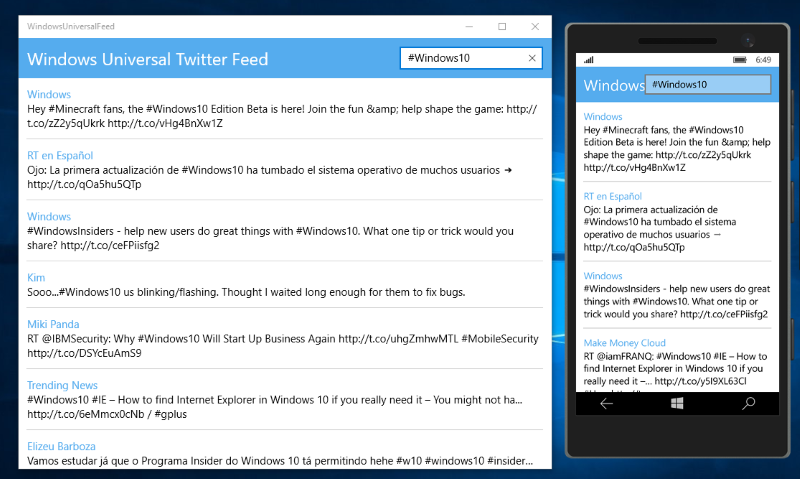
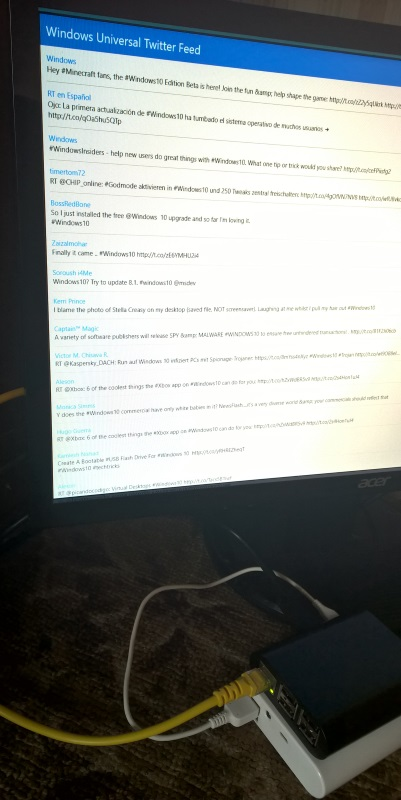

# Windows10TwitterFeed
Simple app for demonstration of the power of universal apps Windows 10.

One code for more devices!

## Desktop and mobile devices on the Windows 10

## Raspberry Pi and other devices on the Windows 10 IoT Core

----
&copy; 2015 Yauheni Pakala | MIT
